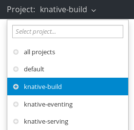
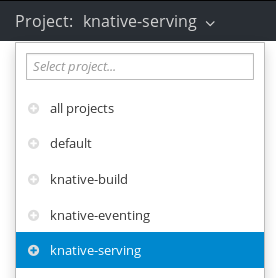
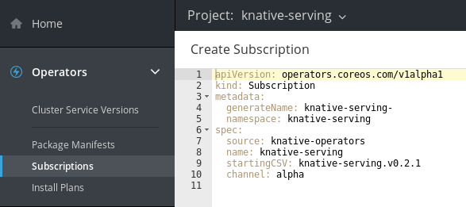
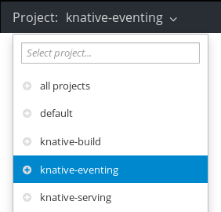
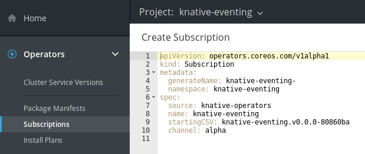

# OpenShift Cloud Functions (OCF)
Developer Preview 0.2.0
------

> **IMPORTANT:** The functionality introduced by OCF is developer preview only. Red Hat supported is not provided, and OCF should not be used in a production environment.

<!-- TOC depthFrom:1 depthTo:6 withLinks:1 updateOnSave:1 orderedList:0 -->

- [OpenShift Cloud Functions (OCF)](#openshift-cloud-functions-ocf)
	- [Prerequisites](#prerequisites)
		- [Supported platform versions](#supported-platform-versions)
	- [Installing OCF](#installing-ocf)
		- [Installing dependencies](#installing-dependencies)
		- [Installing OCF on Minishift](#installing-ocf-on-minishift)
	- [Accessing the OCF console (user interface)](#accessing-the-ocf-console-user-interface)
	- [Installing Knative Operators on Minishift using OLM](#installing-knative-operators-on-minishift-using-olm)
		- [Knative build](#knative-build)
		- [Knative serving](#knative-serving)
		- [Knative eventing](#knative-eventing)

<!-- /TOC -->

## Prerequisites

> **IMPORTANT:** You will need cluster administrator privileges to install and use OCF.

### Supported platform versions

| Platform        | Supported versions           |
| ------------- |:-------------:|
| Minishift      | 1.25.0 or newer |

## Installing OCF

### Installing dependencies

You must install the following dependencies before installing OCF on Minishift.

- [Minishift](https://docs.okd.io/latest/minishift/getting-started/installing.html)
- [Operator Lifecycle Manager (OLM)](https://github.com/operator-framework/operator-lifecycle-manager/blob/master/Documentation/install/install.md#install-the-latest-release-version-of-olm-for-okd)
- [OLM user interface](https://github.com/operator-framework/operator-lifecycle-manager#user-interface)

> **NOTE:** You will need to set the correct hardware configuration for the virtual machine before starting Minishift. You can do this by using the commands
>
>   `minishift config set memory 8GB (2)`  
>
>    `minishift config set cpus 4 (3)`  
>
> For more information, see the [Minishift configuration documentation](https://docs.okd.io/latest/minishift/command-ref/minishift_config.html).

### Installing OCF on Minishift

1. Start Minishift.

   `minishift start`  

2. Set the required environment variables.

   `eval $(minishift oc-env)`  
   `eval $(minishift docker-env)`  

3. Login as administrator.

   `oc login -u system:admin`  

4. Install the OCF `knative-operators CatalogSource`.

   `oc apply -f https://raw.githubusercontent.com/openshift-cloud-functions/knative-operators/master/knative-operators.catalogsource.yaml`  

## Accessing the OCF console (user interface)

1. Open a new terminal window and set the required environment variables.

   `eval $(minishift oc-env)`  
   `eval $(minishift docker-env)`

2. Start up the [OLM user interface](https://github.com/operator-framework/operator-lifecycle-manager#user-interface).

3. Check your IP address by typing `minishift ip` in the terminal. Use this IP address with port 9000 appended to access the console from your web browser.

   `http://127.0.0.1:9000`

## Installing Knative Operators on Minishift using OLM

### Knative build

1. In the terminal, use the following command to create the `knative-build` project and namespace.

   `oc new-project knative-build`  

2. Ensure that you are in the `knative-build` namespace.

   `oc project knative-build`  

3. Update the Security Context Constraints (SCC) by adding the required service account to the `anyuid` and `privileged` SCCs in the `knative-build` namespace.

   `oc adm policy add-scc-to-user anyuid -z default`  
   `oc adm policy add-scc-to-user privileged -z default`  

4. In the console, the `knative-build` project from the drop-down menu.

     

5. Create a new Subscription, by selecting the **Create Subscription** button for the `knative-build` Operator in the **Package Manifests** tab.

     

6. You will be able to see and edit the configuration of the Subscription being created before you finalize this.

   For more information about Subscription configurations, see the [OLM documentation](https://github.com/operator-framework/operator-lifecycle-manager#discovery-catalogs-and-automated-upgrades).  

     

7. The Subscription will now be created. Once this process is complete, you will see the Subscription information in the **Subscriptions** tab.

     

8. You can verify the setup by checking that the pods are running by going to the **Workloads** > **Pods** tab.

     

### Knative serving

1. In the terminal, use the following command to create the `knative-serving` project and namespace.

   `oc new-project knative-serving`  

2. Ensure that you are in the `knative-serving` namespace.

   `oc project knative-serving`  

3. Update the Security Context Constraints (SCC) by adding the required service account to the `anyuid` and `privileged` SCCs in the `knative-serving` namespace.

   `oc adm policy add-scc-to-user anyuid -z default`  
   `oc adm policy add-scc-to-user privileged -z default`  

4. Select the `knative-serving` project from the drop-down menu.

      

5. Create a new Subscription, by selecting the **Create Subscription** button for the `knative-serving` Operator in the **Package Manifests** tab.

     

6. You will be able to see and edit the configuration of the Subscription being created before you finalize this.

   For more information about Subscription configurations, see the [OLM documentation](https://github.com/operator-framework/operator-lifecycle-manager#discovery-catalogs-and-automated-upgrades).  

     

7. he Subscription will now be created. Once this process is complete, you will see the Subscription information in the **Subscriptions** tab.

     

8. You can verify the setup by checking that the pods are running by going to the **Workloads** > **Pods** tab.

     

### Knative eventing

1. In the terminal, use the following command to create the `knative-eventing` project and namespace.

   `oc new-project knative-eventing`  

2. Ensure that you are in the `knative-eventing` namespace.

   `oc project knative-eventing`  

3. Update the Security Context Constraints (SCC) by adding the required service account to the `anyuid` and `privileged` SCCs in the `knative-eventing` namespace.

   `oc adm policy add-scc-to-user anyuid -z default`  
   `oc adm policy add-scc-to-user privileged -z default`  

4. Select the `knative-eventing` project from the drop-down menu.

     

5. Create a new Subscription, by selecting the **Create Subscription** button for the `knative-eventing` Operator in the **Package Manifests** tab.

     

6. You will be able to see and edit the configuration of the Subscription being created before you finalize this.

   For more information about Subscription configurations, see the [OLM documentation](https://github.com/operator-framework/operator-lifecycle-manager#discovery-catalogs-and-automated-upgrades).  

     

7. The Subscription will now be created. Once this process is complete, you will see the Subscription information in the **Subscriptions** tab.

     

8. You can verify the setup by checking that the pods are running by going to the **Workloads** > **Pods** tab.

     
