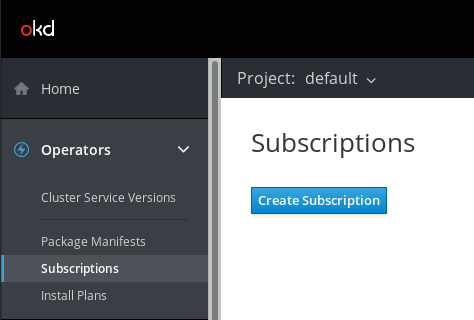
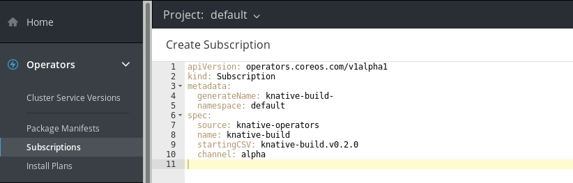

# OpenShift Cloud Functions (OCF)
Developer Preview 0.2.0
------

The functionality introduced by OCF is developer preview only. Red Hat supported is not provided, and OCF should not be used in a production environment.

## About OpenShift Cloud Functions
Introduction information.

## Prerequisites

### Supported platform versions

| Platform        | Supported versions           |
| ------------- |:-------------:|
| Minishift      | 1.25 or better |
| OKD   | 3.11   |
| OpenShift Container Platform     | 3.11      |

### Installing dependencies

#### Minishift
You must install the following dependencies before installing OCF on Minishift.

- [Minishift](https://docs.okd.io/latest/minishift/getting-started/installing.html)
- [Operator Lifecycle Manager (OLM)](https://github.com/operator-framework/operator-lifecycle-manager/blob/master/Documentation/install/install.md#install-the-latest-release-version-of-olm-for-okd)
- [OLM user interface](https://github.com/operator-framework/operator-lifecycle-manager#user-interface)

#### OpenShift Origin (OKD)
Placeholder for dependencies.

#### OpenShift Container Platform
Placeholder for dependencies.

## Installing OCF

### Installing OCF on Minishift

1. Start Minishift.

   `minishift start`  

2. Set the required environment variables.

   `eval $(minishift oc-env)`  
   `eval $(minishift docker-env)`  

3. Login as administrator.

   `oc login -u system:admin`  

4. Install the OCF `knative-operators CatalogSource`.

   `oc apply -f https://raw.githubusercontent.com/openshift-cloud-functions/knative-operators/master/knative-operators.catalogsource.yaml`  

5. Add `cluster-admin` role to user.

   `oc adm policy add-cluster-role-to-user cluster-admin system:serviceaccount:kube-system:default`

#### Accessing the console (user interface)

1. Start up the [OLM user interface](https://github.com/operator-framework/operator-lifecycle-manager#user-interface).

2. Check your IP address by typing `minishift ip` in the terminal. Use this IP address with port 9000 appended to access the console from your web browser.

   `http://127.0.0.0:9000`

## Creating Subscriptions

On accessing the console, you will see **Operators** as a tab in the left panel.
You can create Subscriptions for the available Operators by accessing the **Subscriptions** tab under **Operators**.

1. To create a new Subscription, select the **Create Subscription** button in the **Subscriptions** tab, or go directly to the **Package Manifests** tab.
2. Select the Knative Operator you wish to create a Subscription for, and select **Create Subscription**.

     

3. You will be able to see and edit the configuration of the Subscription being created before you finalize this.

   For more information about Subscription configurations, see the [OLM documentation](https://github.com/operator-framework/operator-lifecycle-manager#discovery-catalogs-and-automated-upgrades).  

     
